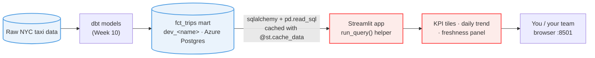

# NYC Taxi — Streamlit Reference
### Practice solution · Daily trend chart

Reference Streamlit metrics app for **HYF Data Track Week 11 (Dashboarding)**, reading the Week 10 dbt mart `fct_trips` from Azure Postgres.

You are on **`practice-daily-trend-solution`**: the reference solution for the daily-trend exercise. Compare it against your own attempt on `practice-daily-trend`.

> 🧭 **All branches:** see the [`main`](../../tree/main) branch for the full map of the chapter track vs the practice track.

## Architecture: source to dashboard



## Setup

```bash
git switch practice-daily-trend-solution
uv sync                                # creates .venv from uv.lock (Python pinned via .python-version)
cp .env.example .env                   # set your Week 9/10 POSTGRES_URL + DB_SCHEMA
uv run streamlit run app.py
```

> New to `uv`? `uv sync` creates the virtual environment and installs the exact versions in `uv.lock` in one step; `uv run` runs a command inside it without activating it manually.

## Prerequisites

- Your Week 10 `fct_trips` table populated in `dev_<name>` on the shared Azure Postgres.
- Your Postgres connection string (`POSTGRES_URL`) and schema name (`DB_SCHEMA`).
