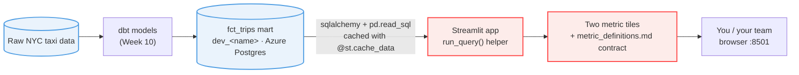

# NYC Taxi — Streamlit Reference
### Practice · Metric definitions as a contract (Ch6)

Reference Streamlit metrics app for **HYF Data Track Week 11 (Dashboarding)**, reading the Week 10 dbt mart `fct_trips` from Azure Postgres.

📐 **Practice.** You are on **`practice-metric-definitions`**: the app is finished and correct, but `metric_definitions.md` has **drifted** from the code. Reconcile the definitions so a teammate could reproduce every on-screen number. See `EXERCISE.md`.

> 🧭 **All branches:** see the [`main`](../../tree/main) branch for the full map of the chapter track vs the practice track.

## Architecture: source to dashboard



## Setup

```bash
git switch practice-metric-definitions
uv sync                                # creates .venv from uv.lock (Python pinned via .python-version)
cp .env.example .env                   # set your Week 9/10 POSTGRES_URL + DB_SCHEMA
uv run streamlit run app.py
```

Then open `metric_definitions.md` and fix the two definitions to match `app.py`.

## Prerequisites

- Your Week 10 `fct_trips` table populated in `dev_<name>` on the shared Azure Postgres.
- Your Postgres connection string (`POSTGRES_URL`) and schema name (`DB_SCHEMA`).
