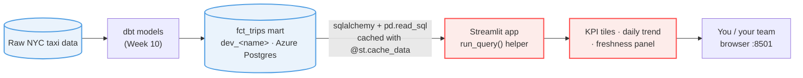

# NYC Taxi — Streamlit Reference

Reference Streamlit metrics app for **HYF Data Track Week 11 (Dashboarding)**. It reads the
Week 10 dbt mart `fct_trips` straight from Azure Postgres — no Airflow, no orchestration.

## Architecture: source to dashboard



The Streamlit app is **code-first**: every query and computed field is Python you control. It reads
the same mart a Metabase dashboard would, but you own the logic end to end.

There are two tracks through this repo, both landing on the same finished dashboard:

- **Chapter track (self-study):** follow the written chapters and build the app up from a bare
  starter. `chapter-4-start` → `chapter-5-start` → `chapter-5-solution`.
- **Practice / live-build track:** the app is complete except for one stubbed function you fill
  in. Used for the live class build (Ch4-Ch5) and as focused solo practice. `practice-kpi-metrics`,
  `practice-caching`, `practice-daily-trend`, and `practice-error-handling`.
- **Advanced track (optional, beyond the chapters):** two patterns you will want on real
  dashboards but that Week 11 does not require: `practice-advanced-state` (session state +
  cached resource) and `practice-form` (batch inputs with `st.form`).

## Branches

| Branch | Track | Purpose |
| --- | --- | --- |
| [`chapter-4-start`](../../tree/chapter-4-start) | Chapter | Starter for **Streamlit Fundamentals (Ch4)**: imports, credentials, `st.title` only. Follow the chapter and add each primitive to `app.py`. |
| [`chapter-5-start`](../../tree/chapter-5-start) | Chapter | Starter for **Building a Metrics Dashboard (Ch5)**: adds the `run_query` caching helper and page config. Build the panels and the sidebar filter from the chapter. |
| [`chapter-5-solution`](../../tree/chapter-5-solution) *(default)* | Chapter | The finished dashboard: all panels plus the sidebar filter. The full reference; clone it as an assignment starting point. |
| [`practice-kpi-metrics`](../../tree/practice-kpi-metrics) / [`-solution`](../../tree/practice-kpi-metrics-solution) | Practice | The **live class build** (Ch4-Ch5) and a focused exercise: `render_kpi_panel` is stubbed, the daily-trend and freshness panels are provided. |
| [`practice-caching`](../../tree/practice-caching) / [`-solution`](../../tree/practice-caching-solution) | Practice | Why Streamlit apps must cache DB calls: `run_query` ships uncached, you add `@st.cache_data` and watch the query time drop. |
| [`practice-daily-trend`](../../tree/practice-daily-trend) / [`-solution`](../../tree/practice-daily-trend-solution) | Practice | Focused exercise: `render_daily_trend_panel` is stubbed, the KPI and freshness panels are provided. |
| [`practice-error-handling`](../../tree/practice-error-handling) / [`-solution`](../../tree/practice-error-handling-solution) | Practice | A dashboard panel queries a missing table and crashes the whole app; wrap it in `try/except` so one broken panel degrades to a warning instead of taking down the page. |
| [`practice-advanced-state`](../../tree/practice-advanced-state) / [`-solution`](../../tree/practice-advanced-state-solution) | Advanced | Beyond the chapters: cache the engine with `@st.cache_resource` and keep a counter across reruns with `st.session_state`. |
| [`practice-form`](../../tree/practice-form) / [`-solution`](../../tree/practice-form-solution) | Advanced | Beyond the chapters: wrap several filters in `st.form` so the query only reruns when **Apply** is clicked, not on every keystroke. |

Each `-solution` branch has a matching non-solution branch: attempt the exercise yourself
first, then `git switch` to the solution branch to compare.

## Setup

```bash
git clone https://github.com/lassebenni/nyc-taxi-streamlit-reference.git
cd nyc-taxi-streamlit-reference
git switch chapter-4-start              # chapter self-study; or a practice-* branch for the live build

uv sync                                # creates .venv and installs from uv.lock
cp .env.example .env                   # set your Week 9/10 POSTGRES_URL + DB_SCHEMA
uv run streamlit run app.py
```

> New to `uv`? It replaces `python -m venv` + `pip install -r requirements.txt`: `uv sync` creates the virtual environment and installs the exact versions pinned in `uv.lock` in one step. `uv run` runs a command inside that environment without activating it manually.

## Prerequisites

- Your Week 10 `fct_trips` table populated in `dev_<name>` on the shared Azure Postgres.
- Your Postgres connection string (`POSTGRES_URL`) and schema name (`DB_SCHEMA`).
